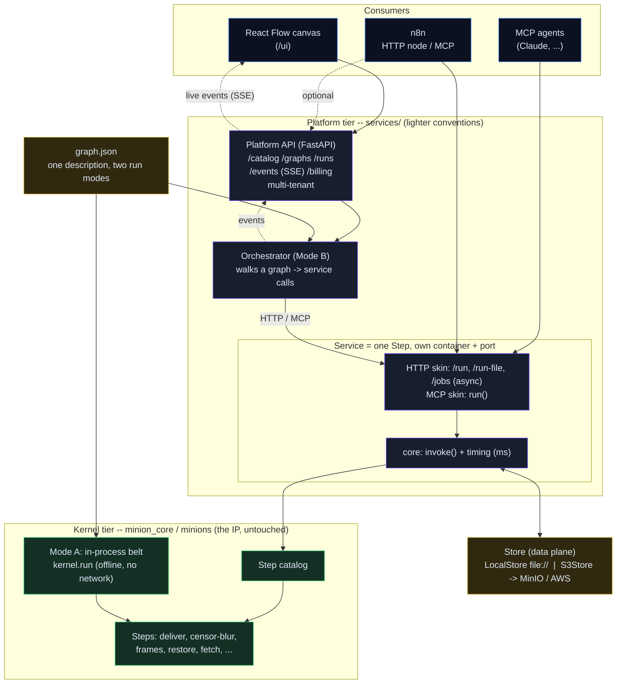

# Architecture at a glance

Companion to [PLATFORM.md](PLATFORM.md) (the platform ADR) and
[ORCHESTRATION.md](ORCHESTRATION.md). One picture of the whole system: the
austere kernel (the IP), the platform tier around it, and the consumers.

## How to read it

- **Two tiers.** The **kernel** (green) is the IP -- the Steps and the belt,
  under the BLUEPRINT laws (ASCII, stdlib-only kernel, ruff ALL, mypy strict).
  The **platform** (purple) wraps it with a web stack and lighter conventions.
  The platform imports the kernel; never the other way round.
- **One core, many skins.** Every Step runs through one seam, `invoke()`.
  Around it sit thin skins: HTTP/OpenAPI (`/run`, `/run-file`, async `/jobs`)
  and MCP. Adding a protocol never touches a Step.
- **Two run modes over one `graph.json`.** *Mode A* is the in-process belt
  (`kernel.run`) -- offline, single node, no network. *Mode B* is the
  orchestrator walking the same graph as service calls. Same Steps; only the
  runner differs. This is why the detach guarantee is structural.
- **Data plane.** Services are stateless: they pass object references, not
  bytes. `Store` is `LocalStore` (offline, `file://`) or `S3Store` (MinIO /
  AWS, `s3://`) -- one image, picked by env.
- **Consumers are equal.** The React Flow canvas, n8n, and MCP agents all call
  the same services over the same APIs, each on its own port. n8n holds only
  wiring; the IP stays in the kernel. Rip any consumer out; the rest run.
- **Metering** rides at `invoke()` (the `ms` on every call) and rolls up into
  Resource Units at `/billing`.
