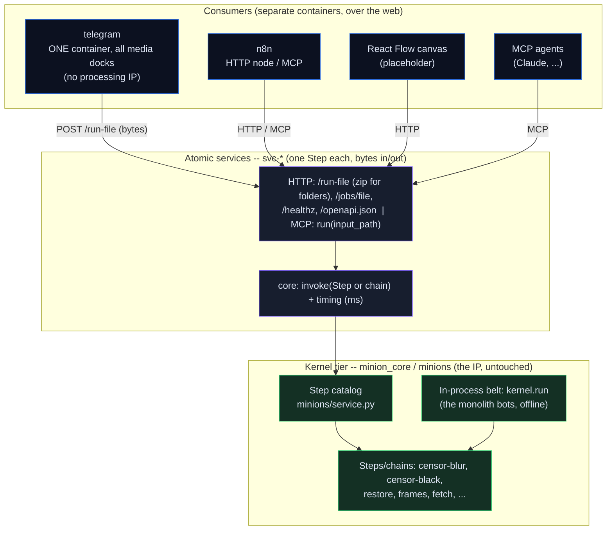

# Architecture at a glance

One picture of the whole system: the austere kernel (the IP), the atomic web
services wrapped around each Step, and the consumers that call them over the
web -- Telegram transports, n8n, a React Flow canvas, MCP agents. Everything
is one docker-compose project.

## How to read it

- **Two tiers.** The **kernel** (green) is the IP -- the Steps and the belt,
  under the BLUEPRINT laws (ASCII, stdlib-only kernel, ruff ALL, mypy strict).
  The **services** tier (purple) wraps a Step with a thin web skin and lighter
  conventions. Services import the kernel; never the other way round.
- **One core, two skins.** Every Step runs through one seam, `invoke()`.
  Around it sit thin skins: HTTP/OpenAPI (`/run-file`, async `/jobs/file`) and
  MCP. Adding a protocol never touches a Step.
- **Bytes in, bytes out.** A service is stateless -- upload a file, get the
  result file back; a fresh temp store per request, no shared object store, no
  cloud SDK. Timing (`ms`) is captured around `invoke` (`X-Run-Ms`).
- **Total Telegram split.** All media-bot processing (blur, frames, restore,
  fetch, ...) runs as `svc-*` services; one `telegram` container owns every
  media Telegram identity and holds no processing code -- each dock POSTs the
  file to its service and sends the bytes back (`minions/telegram.py` ->
  `minions.relay` -> `CallService`). A multi-step bot (restore, frames) is a
  chain in the catalog, so the service does the bot's whole work.
- **Consumers are equal.** The `telegram` container, n8n, React Flow and MCP
  agents all call the same services over the same HTTP/MCP. Rip any consumer
  out; the rest run. The IP never leaves the kernel.
- **The remaining bots stay.** `inbox` (ingest), `model-switch`/`props` (chat
  commands) and `sort`/`batch` (folder watch + cron) are not file-processors
  coupled to Telegram, so they keep running as single in-process belts.
